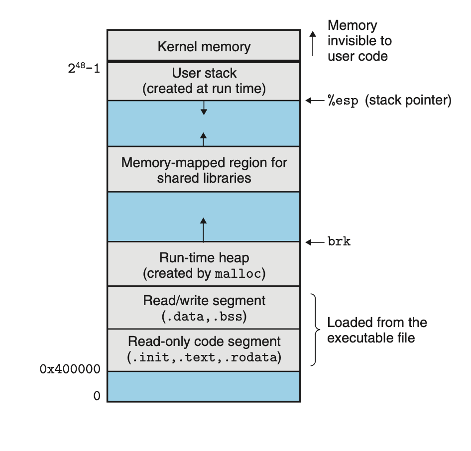
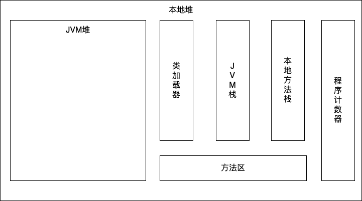
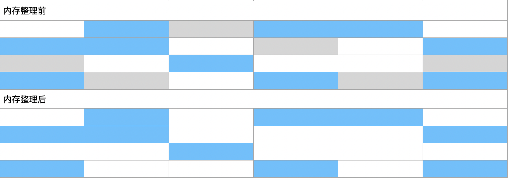
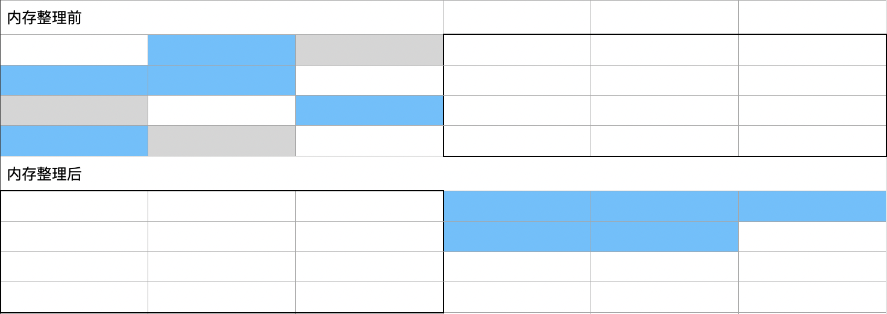
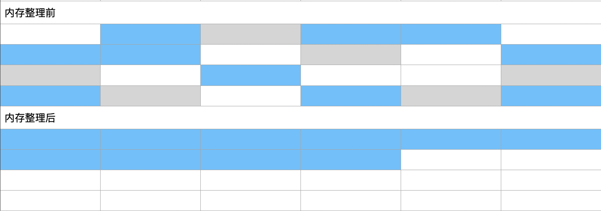

# JAVA GC相关分享

分享关于Java内存管理与垃圾回收的相关知识

## Java内存与进程内存

### JVM内存模型

每一个Java程序都是通过JVM解释执行的，关于JVM内存分布模型，每一位Javaer应该都很熟悉，甚至这是面试的基本问题。但是，有一个问题很少有人关注，在我刚入门Java的时候也一直困扰着我，我想借此机会先来分享这一个点。首先作为一个Java初学者，我来复习一遍这个基础知识。

JVM的内存结构主要为：

* 堆：所有对象的实例都会在堆上分配，为所有线程所共享。堆是一块巨大的内存资源，同时又非常难以管理，后续的内容都是围绕堆这个话题展开。
* 方法区：存储Java程序的类信息、常量、静态变量等内容，可以单纯理解为代码编译之后的产物。方法区为所有线程共享。
* 方法栈：同所有程序一样，为了运行函数调用，需要有一个栈。因为线程是系统调度的最小单位，栈应该是每个线程私有的。
* 本地方法栈：由于JVM本身是由C++编写的，因此，除了运行Java代码外，还有一些虚拟机本身的方法，称为本地方法。Java程序中调用C/C++程序时，在此运行。同样，本地方法栈也是线程私有的。
* 程序计数器：程序为了运行除了栈之外，还需要知道指令的位置，程序计数器提供指向下一条指令的功能，同样是线程私有。

值得一提的，方法区只是JVM的一个概念，而不是一块真正的内存。在JDK1.8之前，方法区的实现方式是永久代。由于字符串等常量存在永久代中，容易出现性能问题和内存溢出，因此到了JDK1.8开始，永久代被移除，取而代之的是元空间（MetaSpace）。元空间不在JVM的堆中，而是在本地内存中分配，此时，方法区的字符串常量和静态变量被移到了堆中，类信息则在元空间中。

### 操作系统进程

Java程序编译成字节码后由虚拟机解释执行，这里的虚拟机表示一个JVM进程，因此每个Java进程同时也是一个系统进程，具有系统进程的特征。在操作系统的理论中，进程是系统资源分配的基本单位，例如在Linux系统中，进程的内存布局如下图所示：

每个Java进程也应当符合上述内存布局，从0x400000开始分别是：只读数据段，其中`text`段表示代码段；读写数据段，`data`表示常亮等已初始化的空间,`bss`表示未初始化数据段；往上是进程的堆空间，由`brk`标识堆顶，向上申请空间。从最高地址向下首先是用户态不可见的内核地址空间，随后便是用户栈，由寄存器rsp表示栈顶，向下扩张。在堆和栈之间的空间为共享库的映射区域。

由此可见，JVM的内存设计和系统进程很相似，它的堆栈在系统进程内存模型的基础上是怎么做进一步分配的，是否存在一些对应关系？这正是开头一直困惑我的问题，在对Java有一些了解之后，我对这个问题有了一些理解。

### 带内存池的系统进程

JVM是一个带内存管理的Java程序解释器，在底层实现了不同操作系统的接口，以此实现跨平台的功能。JVM主要包括执行引擎、类加载器、运行时数据区三大部分：上文的内存结构是运行时数据区的部分，类加载器将Java字节码文件加载到JVM内存，执行引擎主要包括字节码解释器、即时编译器等。

上述部分所需要的空间，包括程序的堆、栈和元空间都在进程的本地堆中分配，而进程自身的`text`、`data`、`bss`和本地栈主要支持JVM自身的运行。至于JVM中的堆，和其他组成部分一样，是JVM进程在自己的堆中分配出的一块空间，相当于一个内存池，在内存池内执行进一步的内存分配。JVM的垃圾回收策略就是管理这个内存池的工具，不同的垃圾回收策略有对应的分配和回收策略，因此，与其说是垃圾回收理论，不如说是内存管理理论。

## 内存管理策略

本节开始，与内存相关的内容都是针对JVM的堆内存了，不同的内存管理策略都有对应的分配策略和回收策略。每一个管理策略还对应了很多的参数，不同的策略和参数的配置对程序运行的性能也会有很大的影响。

Java的垃圾收集理论发展了这么多年，诞生了各种形形色色的回收算法，比如Serial，Parallel，CMS，G1和新势力ZGC等等。各种复杂的算法背后，它们都是基于三个最基本的收集思想来实现的：标记-清除、标记-复制、标记-整理。

### 标记-清除

标记-清除是最简单的收集思想，首先将所有扫描到的存活的对象标记，然后进入清除阶段，此时将未被标记的对象视为垃圾统一回收。

这个方法带来的缺点很明显：会产生大量且不连续的小碎片。在清理完成之后如果需要分配较大的对象，有可能因为没有足够的连续空间而再次出发垃圾回收。

### 标记-复制

标记-复制方法将内存分为大小相同的两块，对象的分配只在其中的一块中进行，标记阶段结束后，将这块内存中的存活对象全部复制到另一块空闲内存中，然后将这块内存全部清理掉。随后两块内存的职责交换，并以此往复。

标记-复制方法可以很好得避免内存碎片的产生，但是同样有很大的缺点：

* 有效内存只有总内存的一半，很大程度上浪费了内存空间。
* 对象的复制会带来额外的开销。

### 标记-整理

标记-整理方法是在对象标记过程中，将存活的对象向内存空间的一端进行移动，标记结束后直接将边界以外的内存清除掉，剩下的空间是一块完整的连续的内存。

标记-整理方法即完整地利用了一整块内存，又不会产生内存碎片，清理效果是三种方法中最彻底的。但是一次对象的移动相当于一次复制，也是有开销的，如果在一次垃圾回收过程中存活的对象非常多，效率对比标记-清除反而会降低很多。一次标记-整理过程中必须暂停所有用户线程，这将会导致进程响应时间变慢。

### 分代理论

在垃圾回收理论发展的过程中，分代理论也是一个特别重要的里程碑，它在上述三种回收方式基础上结合对象存活时间不同的特征而提出的。

在JVM中，有些对象诞生和消亡非常频繁。例如，在一个方法调用中的一个局部变量，在这个方法返回之后就消亡了，应该被回收。而有些对象的存活时间特别长，例如存储一个请求上下文的对象，这些对象可能在多次的回收之后都会存在。分代理论就是基于对象的这个特征，将JVM堆内存分为了年轻代和老年代两个区域。顾名思义，年轻代区域存放短暂且频繁的对象，老年代则存放长时间存在的对象。

分代带来的好处是，JVM可以分别对两个内存代设置不同的垃圾回收策略。先看年轻代，由于对象的分配和消亡非常频繁，GC的次数也相应频繁，每次GC中存活的对象比例比较小。对此，标记-复制方法是比较适合这种场景的。早期JVM对于年轻代的GC策略是标记-复制算法的升级版，将年轻代分成进一步划分，为一块较大的Eden空间和两块较小但是大小相等的Survivor空间（默认是8:1:1），对象的分配在Eden区和其中的一个Survivor区进行。对比单纯的标记-复制，可以保证较高的使用比例。

老年代对象的特点是存活时间比较久，而且数量可能比较多，对应发生GC的次数没有年轻代来得频繁，但是单次GC的时间会比年轻代要长好多，这个时间往往对于线上业务的影响非常大。上文提到，虽然标记-整理算法可以彻底清理内存，但是对于延迟要求较高的场景是不合适的，而标记-清除方法是个快速的方法，可以降低GC停顿时间，甚至不停顿，但是内存碎片的存在会增加GC次数。这是一个侧重吞吐量和低延迟的选择，而侧重低延迟的CMS算法对于老年代的策略采用了一个这种方案，对于前期的老年代GC，使用标记-清除方法，容忍一定的内存碎片，如果碎片化程度影响大到对象的分配时，采用标记-清除方法彻底清理以获得连续的空间。

## 如何找对象

### 可达性分析

### CardTable

## 早期GC

## CMS和G1

## ZGC

### 命名的由来

### 特性

